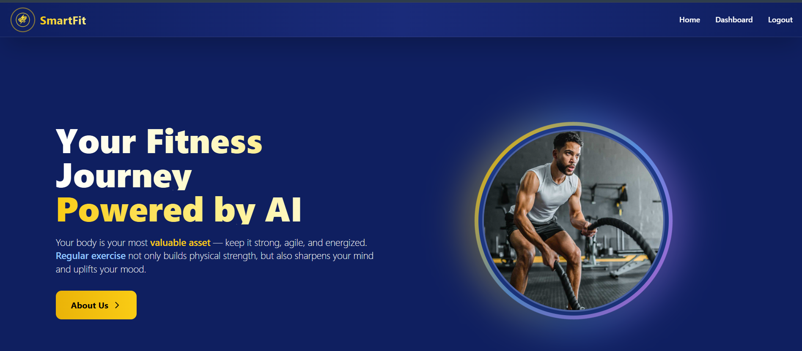
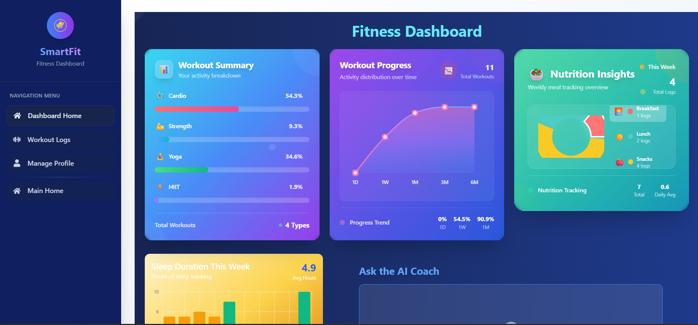
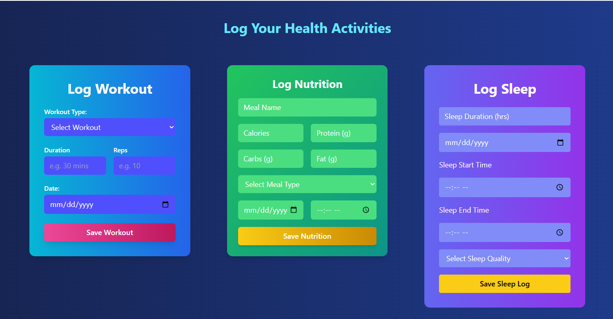

# 🏋️‍♂️ SmartFit – Personalized Fitness & Wellness App


<p align="center">
  
</p>

## 📘 About

**SmartFit** is a full-featured fitness tracker that enables users to log workouts, monitor nutrition, and track sleep habits — all in one place. It features a smart dashboard with **AI-powered suggestions** tailored to your health data, helping you stay consistent and informed in your fitness journey.

---

## 🛠️ Tech Stack

<p align="center">
  
  
  
  
  
</p>

---


###  Installation

1. **Clone the repository**
```
git clone https://github.com/symadev/smart-fitness-tracker.git
```

2. **Navigate to project directory**
```
cd smart-fitness-tracker
```


3. **Install dependencies**
```
npm install
```


4. **Start development server**
``` 
npm run dev
```


5. **Open your browser**
 ```
 Navigate to http://localhost:5173
 ```

---


<p align="center">
  
</p>

<p align="center">
  
</p>


## 🎯 How to Use

### Step 1: 🏠 **Get Started**
Open the application in your browser and log in or sign up to access your personal fitness dashboard.

### Step 2: 💪 **Log Your Activities**
Use the dashboard interface to:
- Record your workouts (exercise, sets, reps, duration)
- Add meals with calories and macronutrients
- Track your daily sleep hours and quality

### Step 3: 📊 **Visualize Your Progress**
View real-time charts for your:
- Weekly workout consistency
- Nutrition and calorie trends
- Sleep patterns and progress

### Step 4: 🤖 **Get Smart Suggestions**
Receive personalized health insights powered by AI based on your logs. Improve your habits through adaptive, goal-based suggestions.

---


## 🤝 Contributing

We welcome contributions from the community! Here's how you can help make SkillSync even better:

### 🔧 **Development Setup**

1. **Fork the repository**
   ```
   git fork https://github.com/symadev/smart-fitness-tracker.git
   ```

2. **Create a feature branch**
   ```
   git checkout -b feature/your-feature-name
   ```


3. **Commit your changes**
   ```
   git commit -m "Add feature"
   ```

4. **Push to your fork**
   ```
   git push origin feature/your-feature-name
   ```

5. **Open a Pull Request**
   - Provide a clear description of changes
   - Include screenshots if applicable
   - Reference any related issues


## 📄 License

This project is licensed under the MIT License - see the [LICENSE](LICENSE) file for details.

---


